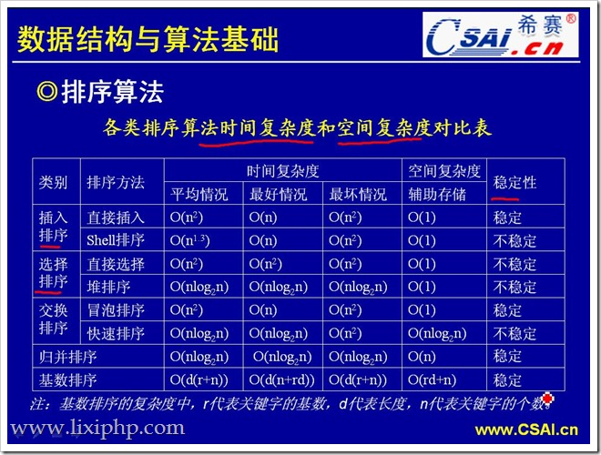

# 排序算法总结

首先贴一张各类排序算法的时空复杂度对比图：



## 一、插入排序

- 基本思想：每步将一个数字插入数组前面已经排序的序列的合适位置，直到全部插入排序完为止。

- 关键问题：在前面已经排好序的序列中找到合适的插入位置。

### 1.  直接插入排序

- 基本思想：规定待排序数组第一个是有序的，从第二个元素开始和第一个比较，若比第一个小这插入第一个之前，这样前面两个就是有序的。以此类推比较第三个元素，直至全部比较插入完。

- 排序过程：待排序数组：[3，2，5，4，1，6]
```text
    第一轮：假定第一个元素 3 有序，从 2 开始。
           记录 temp = 2，由于 temp < 3，因此把 3 赋值到 2 的位置，3 前面已没有可比较的元素了，把 temp 复制到原先 3 的位置。
           排序过后组数为：[2，3，5，4，1，6] ，因此前 2 位已经是有序的。
    
    第二轮：temp = 5，temp > 3 ，因此相当于 5 就应该插入3 的后面，即保持不变。
           排序过后数组为：[2，3，5，4，1，6] ，因此前 3 位已经是有序的。

    第三轮：temp = 4，temp < 5，把 5 赋值到 4 的位置，数组变为：[2，3，5，5，1，6]。
           继续 temp > 3，这把 temp 插入3 的后面，数组变为：[2，3，4，5，1，6]
           排序过后数组为：[2，3，5，4，1，6] ，因此前 4 位已经是有序的。

        以此类推完成全部完成排序。。。
```

- 代码实现：[插入排序代码实现和分析](../../java/com/aduan/study/algorithmsort/InsertionSort.java)

  

###  2. 二分插入排序

- 基本思想：二分法插入排序的思想和直接插入一样，只是找合适的插入位置的方式不同，这里是按二分法找到合适的位置，可以减少比较的次数。

- 排序过程： TODO - 待补充

###  3. 希尔排序

- 基本思想：先取一个小于n的整数d1作为第一个增量，把文件的全部记录分成d1个组。所有距离为d1的倍数的记录放在同一个组中。先在各组内进行直接插入排序；然后，取第二个增量d2

- 排序过程： TODO - 待补充


## 二、选择排序

- 基本思想：每趟从待排序的记录序列中选择关键字最小的记录放置到已排序表的最前位置，直到全部排完。

- 关键问题：在剩余的待排序记录序列中找到最小关键码记录。 

### 1. 直接选择排序

- 基本思想：在要排序的一组数中，选出最小的一个数与第一个位置的数交换；然后在剩下的数当中再找最小的与第二个位置的数交换，如此循环到倒数第二个数和最后一个数比较为止。

- 排序过程： TODO - 待补充

### 2. 堆排序

- 基本思想： TODO - 待补充

- 排序过程： TODO - 待补充


## 三、交换排序

### 1. 冒泡排序

- 基本思想：在要排序的一组数中，对当前还未排好序的范围内的全部数，自上而下对相邻的两个数依次进行比较和调整，让较大的数往下沉，较小的往上冒。即：每当两相邻的数比较后发现它们的排序与排序要求相反时，就将它们互换。

- 排序过程：

### 2. 快速排序

- 基本思想：选择一个基准元素,通常选择第一个元素或者最后一个元素,通过一趟扫描，将待排序列分成两部分,一部分比基准元素小,一部分大于等于基准元素,此时基准元素在其排好序后的正确位置,然后再用同样的方法递归地排序划分的两部分。

- 排序过程： TODO - 待补充


## 四、归并排序

- 基本思想：归并（Merge）排序法是将两个（或两个以上）有序表合并成一个新的有序表，即把待排序序列分为若干个子序列，每个子序列是有序的。然后再把有序子序列合并为整体有序序列。

- 排序过程：


## 五、基数排序

- 基本思想：将所有待比较数值（正整数）统一为同样的数位长度，数位较短的数前面补零。然后，从最低位开始，依次进行一次排序。这样从最低位排序一直到最高位排序完成以后,数列就变成一个有序序列。

- 排序过程：


转载请注明出处：
http://blog.csdn.net/gane_cheng/article/details/52652705
http://www.ganecheng.tech/blog/52652705.html （浏览效果更好）